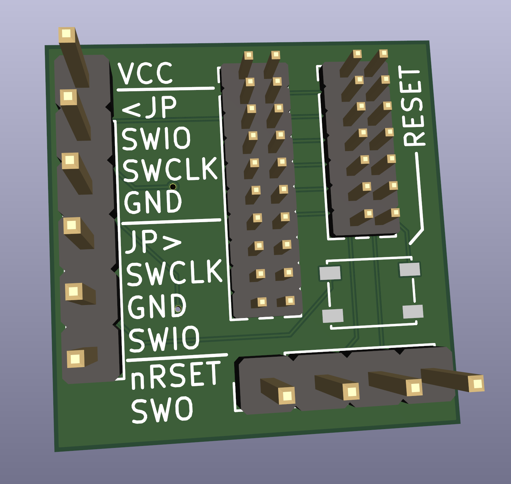
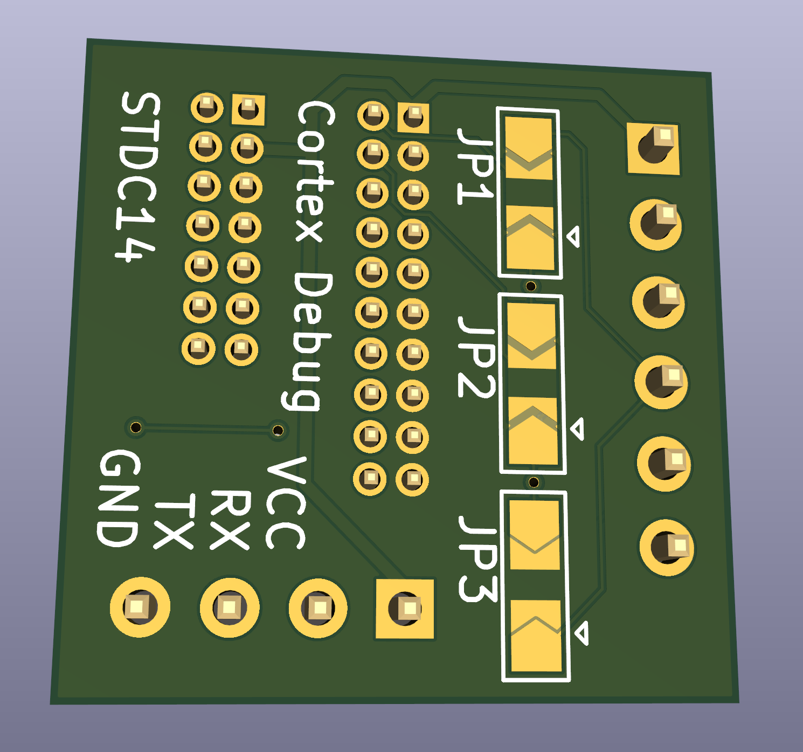

# ST-Link_V3_MINI_Adapter

Very simple board made to convert STDC14 on ST-Link V3 to following standards:
1. Cortex Debug ETM 20P (well ETM pins are not connected)
2. Cortex Debug 10P
3. ST Nucleo 6P
4. Blue/Black Pill 4P + 2P (nReset and SWO)

## Pictures

